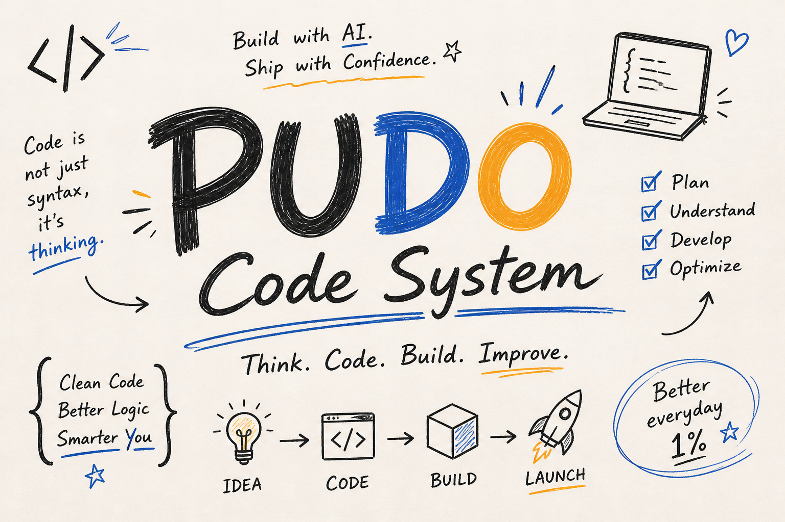
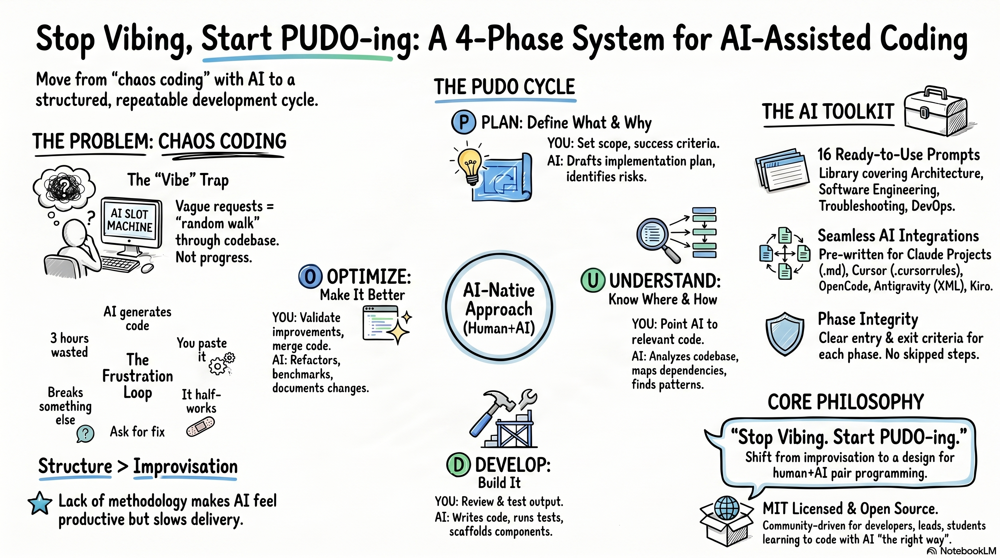

<p align="center">
  <a href="https://forg.to/products/pudo" target="_blank" rel="noopener">
    
  </a>
  <a href="https://forg.to/products/pudo" target="_blank" rel="noopener">
  </a>
  <a href="https://unikorn.vn/p/pudo?ref=embed-pudo" target="_blank">
    
  </a>
  <a href="https://unikorn.vn/p/pudo?ref=embed-pudo" target="_blank">
    
  </a>
</p>

<p align="center">
  
</p>

<h3 align="center">A structured 4-phase methodology for coding with AI assistants.</h3>

<p align="center">
  <a href="LICENSE"></a>
  
  <a href="CONTRIBUTING.md"></a>
  
</p>

<p align="center">
  <b>🌍 Languages:</b>
  <a href="README.md">English</a> |
  <a href="README.vi.md">Tiếng Việt</a> |
  <a href="README.pt.md">Português</a> |
  <a href="README.es.md">Español</a> |
  <a href="README.ru.md">Русский</a>
</p>

<p align="center">
  <a href="https://www.youtube.com/watch?v=yjRRjrx6Ews" target="_blank">
    
    <br />
    <strong>🎥 Watch the PUDO Code System overview video</strong>
  </a>
</p>

---

## The Problem

You open your editor. You type a vague request to your AI assistant. It generates something. You paste it in. It half-works. You ask for a fix. It breaks something else. Repeat for 3 hours.

**This is chaos coding.** It feels productive, but it's not.

The issue isn't the AI — it's the **lack of structure**. Without a clear methodology, AI-assisted development becomes a random walk through your codebase.

## The Solution: PUDO

**PUDO** is an AI Agent Operating Layer for configuring coding agents across Cursor, Claude, Codex, GitHub Copilot, and Gemini/Antigravity: installable rules, measurable quality gates, token-budgeted prompts, workflow templates, and benchmark evidence for real codebases.

Recent research on configuring agentic coding tools identifies repository-level context files as the dominant mechanism and notes `AGENTS.md` emerging as an interoperable standard across tools, while advanced mechanisms such as Skills and Subagents remain less adopted. PUDO starts from that repo-level layer and adds executable checks, quality gates, handoff, and measurement. ([arXiv:2602.14690](https://arxiv.org/abs/2602.14690))

| Phase | Goal | You Do | AI Does |
|:---:|---|---|---|
| **(P) Plan** | Define *what* and *why* | Set scope, constraints, success criteria | Draft implementation plan, identify risks |
| **(U) Understand** | Know *where* and *how* | Point to relevant code, explain context | Analyze codebase, map dependencies, find patterns |
| **(D) Develop** | Build *it* | Review, approve, test | Write code, run tests, track progress |
| **(O) Optimize** | Make *it better* | Validate improvements, merge | Refactor, benchmark, document changes |

<p align="center">
  
</p>

> **Key insight:** PUDO is a **cycle**, not a pipeline. You revisit phases as you learn more. A discovery in Develop might send you back to Plan. That's expected.

## Install Into a Project

Use the init command to generate agent rules, PR templates, quality checklists, and a PUDO session handoff file in a real repository:

```bash
npx pudo-code-system init
```

Non-interactive setup:

```bash
npx pudo-code-system init --yes --tools=cursor,claude,codex,copilot,gemini,opencode,kiro --project=nextjs --strictness=standard
```

Generated files can include `AGENTS.md`, `CLAUDE.md`, `GEMINI.md`, `.cursor/rules/pudo-core.mdc`, `.github/copilot-instructions.md`, `opencode/opencode.md`, `kiro/system-prompt.md`, `.github/pull_request_template.md`, `.pudo/config.json`, and `.pudo/session.md`.

Executable workflow:

```bash
npx pudo-code-system check
npx pudo-code-system score
npx pudo-code-system doctor
```

## Onboarding Paths

| Path | Best For | Setup |
|---|---|---|
| **Solo dev** | Small projects, personal repos, fast iteration | `npx pudo-code-system init --strictness=lite` |
| **Team lead** | Shared PR review, handoff, medium features | `npx pudo-code-system init --strictness=standard --tools=cursor,claude,codex,copilot,gemini,opencode,kiro` |
| **Enterprise / security** | Production, compliance, migrations, sensitive data | `npx pudo-code-system init --strictness=enterprise` plus Release Gate |

## PUDO Modes

Use the smallest mode that safely fits the task. See [PUDO Modes](docs/pudo-modes.md) for the full guide.

| Mode | Use For | Process |
|---|---|---|
| **PUDO Lite** | Small fixes, scripts, tasks under 30 minutes | Three checks: scope, relevant files, verification |
| **PUDO Standard** | Medium features, real bugs, focused refactors | Full Plan -> Understand -> Develop -> Optimize |
| **PUDO Enterprise** | Team, production, security, compliance | Full PUDO plus owner, rollback, monitoring, migration, risk log |

## Quality Gates

Each phase ends with a gate. Do not move forward until the gate passes, or until the risk is explicitly accepted.

| Gate | Run Before | Must Prove |
|---|---|---|
| **Plan Gate** | Understand | Scope, success criteria, constraints, and out-of-scope items are clear |
| **Understand Gate** | Develop | Relevant files, architecture, APIs, and patterns were verified |
| **Develop Gate** | Optimize | Implementation stays in scope, has tests, and handles key edge cases |
| **Optimize Gate** | Release | Refactors preserve behavior; performance, security, docs, and risks were reviewed |
| **Release Gate** | Merge/deploy | Changelog, migration, rollback, monitoring, and owner approval are handled |

Start with [Quality Gates](quality/quality-gates.md), use the [QC checklists](quality/qc-checklists.md), review AI-generated changes with [AI Output Review](quality/ai-output-review.md), enforce [Anti-Hallucination Rules](quality/anti-hallucination.md), manage context with [Token Budget Rules](quality/token-budget.md), engineer context with [Context Engineering](docs/context-engineering.md), and pull failure modes from the [general edge case catalogue](quality/edge-cases/general.md).

## Measurement Targets

These numbers are directional targets to validate with your own benchmark data, not proven PUDO-wide guarantees. Current public evidence is a sample measurement, so do not cite the table as a benchmark claim until enough measured cases exist. Gains depend on task size, repo quality, and how consistently the team follows PUDO.

| Task Type | Token Waste Reduction Target | Dev Time Reduction Target |
|---|---:|---:|
| One-line fix / small script | 0-8% | -5% to +5% |
| Small/medium feature | 25-38% | 12-20% |
| Hard bug / production issue | 22-35% | 10-18% |
| Multi-file feature / tests / team handoff | 35-48% | 18-28% |
| Measurement target for mature usage | 34% | 18% |

Measure your own results with the [Benchmark Kit](benchmarks/). Track tokens, AI turns, failed attempts, unnecessary file reads, time to verified implementation, bugs found after AI output, and PR review comments. See the sample measured case in [benchmarks/results/stripe-webhook-2026-05](benchmarks/results/stripe-webhook-2026-05/).

## Quick Start

### 1. Start with Plan

Before writing any code, define what you're building:

```
I need to build [FEATURE]. 
The success criteria are [CRITERIA].
The constraints are [CONSTRAINTS].
Create an implementation plan before writing any code.
```

### 2. Move to Understand

Research before you build:

```
Before implementing, analyze the existing codebase:
- What patterns are already established?
- What dependencies are involved?
- What could break?
```

### 3. Execute in Develop

Build with structure:

```
Implement the plan. Track progress with a task checklist.
Write tests alongside the implementation.
Flag any deviations from the plan.
```

### 4. Close with Optimize

Don't ship the first draft:

```
Review the implementation:
- Are there performance improvements?
- Is the code consistent with existing patterns?
- Write a walkthrough summarizing what changed and why.
```

### 5. Repeat

Every task, every feature, every bug fix. **Plan → Understand → Develop → Optimize.**

## Examples

See PUDO applied to real-world scenarios:

| # | Scenario | Complexity | Key Takeaway |
|---|----------|:---:|---|
| [01](examples/01-landing-page/walkthrough.md) | Building a landing page | Beginner | How Plan prevents scope creep |
| [02](examples/02-api-integration/walkthrough.md) | Stripe API integration | Intermediate | How Understand saves debugging time |
| [03](examples/03-debug-production/walkthrough.md) | Fixing a production bug | Advanced | How the full cycle prevents regressions |
| [04](examples/04-quality-gate-failure/walkthrough.md) | Quality gate failure case | Intermediate | How a failed gate prevents bad releases |
| [05](examples/05-before-after-token-waste/metrics.md) | Before/after token waste | Intermediate | How source grounding reduces wasted AI turns |

## Developer Operating Kit

PUDO includes files that can be installed into real projects, not only read as methodology docs:

| Area | Files |
|---|---|
| CLI | [bin/pudo.js](bin/pudo.js), [package.json](package.json) |
| Project state | [.pudo/config.json](.pudo/config.json), [.pudo/session.md](.pudo/session.md), [.pudo/checklists/release.md](.pudo/checklists/release.md) |
| GitHub workflow | [.github/pull_request_template.md](.github/pull_request_template.md), [.github/ISSUE_TEMPLATE/](.github/ISSUE_TEMPLATE/), [.github/workflows/pudo-check.yml](.github/workflows/pudo-check.yml) |
| Stack templates | [templates/](templates/) |
| Measurement | [benchmarks/](benchmarks/) |
| Context engineering | [docs/context-engineering.md](docs/context-engineering.md), [docs/agent-skill-contract.md](docs/agent-skill-contract.md) |
| Release tracking | [CHANGELOG.md](CHANGELOG.md) |
| Roadmap | [ROADMAP.md](ROADMAP.md) |

## Prompt Library

PUDO ships with a [ready-to-use prompt library](prompts/) — **21 prompts** across 4 phases and domain skills that you can copy-paste into any AI assistant. Each phase directory includes a detailed `README.md` explaining how to modify and extend the prompts for your team's needs.

| Phase | Prompts |
|---|---|
| **(P)** Plan | [Scope Definition](prompts/plan/scope-definition.md) · [Architecture Draft](prompts/plan/architecture-draft.md) · [Risk Assessment](prompts/plan/risk-assessment.md) · [Database Schema](prompts/plan/database-schema-design.md) · [API Contract](prompts/plan/api-contract-design.md) · [Security Threat Model](prompts/plan/security-threat-model.md) |
| **(U)** Understand | [Codebase Analysis](prompts/understand/codebase-analysis.md) · [Dependency Audit](prompts/understand/dependency-audit.md) · [Pattern Recognition](prompts/understand/pattern-recognition.md) · [Crash Log Analysis](prompts/understand/crash-log-analysis.md) |
| **(D)** Develop | [Feature Implementation](prompts/develop/feature-implementation.md) · [Test-Driven Dev](prompts/develop/test-driven-dev.md) · [Component Scaffold](prompts/develop/component-scaffold.md) · [Integration Test Suite](prompts/develop/integration-test-suite.md) · [E2E Test Suite](prompts/develop/e2e-test-suite.md) |
| **(O)** Optimize | [Performance Review](prompts/optimize/performance-review.md) · [Code Review Checklist](prompts/optimize/code-review-checklist.md) · [Refactor Opportunities](prompts/optimize/refactor-opportunities.md) · [Memory Profiling](prompts/optimize/memory-profiling.md) · [Network Troubleshooting](prompts/optimize/network-troubleshooting.md) |
| **Skills** | [Architecture & Planning](skills/plan/SKILL.md) · [Software Engineering](skills/code/SKILL.md) · [Troubleshooting & Debugging](skills/debug/SKILL.md) · [DevOps Engineering](skills/devops/SKILL.md) · [Test Engineering](skills/test/SKILL.md) |
| **DevOps Tools** | [GitHub Actions](skills/devops/github-actions/SKILL.md) · [GitLab CI](skills/devops/gitlab-ci/SKILL.md) · [Argo CD](skills/devops/argo-cd/SKILL.md) · [Jenkins](skills/devops/jenkins/SKILL.md) · [Terraform](skills/devops/terraform/SKILL.md) · [Docker](skills/devops/docker/SKILL.md) · [Kubernetes](skills/devops/kubernetes/SKILL.md) |

## AI Integrations

PUDO is designed to be the default operating system for AI coding agents. Prefer the current config format for each tool, while keeping legacy files where they still help older workspaces.

| Tool | Current Files | Recommended Setup | Status |
|---|---|---|---|
| **Codex** | [AGENTS.md](AGENTS.md), [codex/AGENTS.md](codex/AGENTS.md) | Keep root `AGENTS.md`; copy `codex/AGENTS.md` into target repos that need a fuller Codex template | OK |
| **Claude Code / Projects** | [CLAUDE.md](CLAUDE.md), [claude/CLAUDE.md](claude/CLAUDE.md), [.claude/settings.json](.claude/settings.json) | Use root `CLAUDE.md` as the bridge; keep detailed Claude workflow in `claude/CLAUDE.md` | Updated |
| **Cursor** | [Project Rules](cursor/.cursor/rules/pudo-core.mdc), [legacy .cursorrules](cursor/.cursorrules) | Prefer `.cursor/rules/*.mdc`; keep `.cursorrules` for legacy Cursor versions | Migrated |
| **GitHub Copilot** | [.github/copilot-instructions.md](.github/copilot-instructions.md), [.github/instructions/](.github/instructions/) | Use repo-wide instructions plus path-specific `.instructions.md` files | Added |
| **Gemini** | [GEMINI.md](GEMINI.md), [antigravity/instructions.xml](antigravity/instructions.xml) | Use `GEMINI.md` as the repo instruction bridge; keep Antigravity XML for Gemini-style workspaces | CLI generated |
| **OpenCode** | [opencode/opencode.md](opencode/opencode.md) | Add to OpenCode system prompts or workspace instructions | CLI generated |
| **Kiro** | [kiro/system-prompt.md](kiro/system-prompt.md) | Set as the Kiro system prompt | CLI generated |

## Philosophy

PUDO isn't just a checklist — it's a mindset. Read the [full philosophy](docs/philosophy.md) to understand the principles behind the method.

**TL;DR:**
- **Anti-chaos** — Structure beats improvisation at scale
- **Iterative** — It's a cycle, not a waterfall
- **AI-native** — Designed for human+AI pair programming
- **Phase integrity** — Each phase has clear entry and exit criteria

## When Not To Use PUDO

PUDO may be overkill for one-line fixes, throwaway prototypes, pure exploration, and non-critical scripts. Use the full cycle when correctness, maintainability, security, or team handoff matters.

## Current Limitations

- PUDO does not guarantee AI output is correct.
- Human review is still required.
- Security-sensitive changes still need dedicated security review.
- Examples are illustrative, not universal.
- The method requires discipline; skipping gates turns it back into ad hoc prompting.

## Who Is This For?

- **Developers using AI assistants** (ChatGPT, Claude, Gemini, Copilot, etc.) who want better results
- **Team leads** looking for a shared methodology for AI-assisted development
- **Students** learning to code with AI the right way from day one

## Contributing

PUDO grows with the community. See [CONTRIBUTING.md](CONTRIBUTING.md) for how to:

- Add new prompts to the library
- Submit real-world example walkthroughs
- Improve the documentation

## Support & Funding

If you find PUDO helpful, consider supporting the project:

<iframe src="https://github.com/sponsors/DongDuong2001/button" title="Sponsor DongDuong2001" height="32" width="114" style="border: 0; border-radius: 6px;"></iframe>

- [GitHub Sponsors](https://github.com/sponsors/DongDuong2001)
- [Patreon](https://patreon.com/DongDuong2001)
- [Ko-fi](https://ko-fi.com/dongphuduong)
- [Buy Me a Coffee](https://buymeacoffee.com/lab68dev)
- **PayPal:** dongduong840@gmail.com

## License

[MIT](LICENSE) — Use it, fork it, make it yours.

---

<p align="center">
  <strong>Stop vibing. Start PUDO-ing.</strong>
  <br /><br />
  <em>Plan → Understand → Develop → Optimize</em>
</p>
